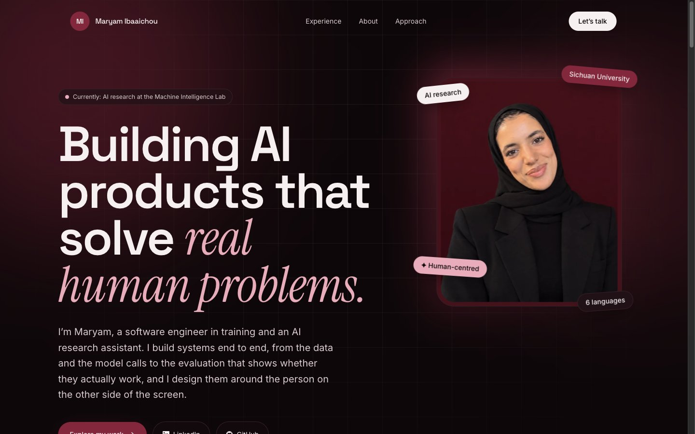

# maryamibaaichou.com

My personal website: who I am, what I've worked on, and how I approach building AI products.

**Live:** [maryamibaaichou.com](https://maryamibaaichou.com)



## Stack

- [Next.js](https://nextjs.org) (App Router) with a fully static export
- TypeScript
- Tailwind CSS v4
- Deployed on Vercel

## Features

- Responsive, mobile-first layout
- Accessible: semantic HTML, keyboard navigation, skip link, reduced-motion support
- SEO: metadata, Open Graph image, JSON-LD, sitemap and robots.txt
- All content lives in one file, [`src/content/site.ts`](src/content/site.ts), so updating the site means editing text, not components

## Run locally

```bash
npm install
npm run dev      # http://localhost:3000
```

```bash
npm run build    # static site in ./out
npm run lint
```

## Structure

```
src/
  app/          layout, page, metadata, sitemap, robots
  components/   one component per section (Hero, SelectedWork, About, …)
  content/      site.ts: all text, projects, skills and timeline
public/         images and Open Graph card
scripts/        image preparation (crop and resize only)
```

## License

The code is available under the [MIT License](LICENSE). The text and photos are mine and are not covered by the license.
